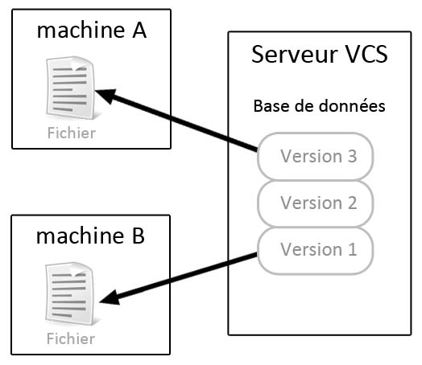
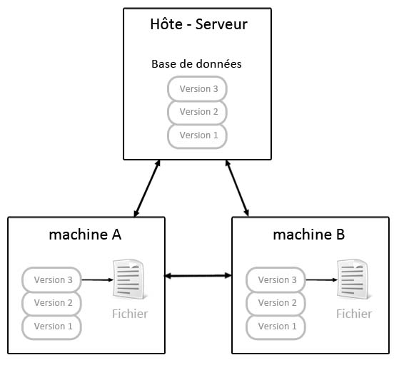

# Présentation de Git

## Qu'est ce que le versionning ?

> Un **logiciel de gestion de** [**versions**](https://fr.wikipedia.org/wiki/Version_d%27un_logiciel) \(ou **VCS** en [anglais](https://fr.wikipedia.org/wiki/Anglais), pour _version control system_\) est un [logiciel](https://fr.wikipedia.org/wiki/Logiciel) qui permet de stocker un ensemble de [fichiers](https://fr.wikipedia.org/wiki/Fichier_%28informatique%29) en conservant la chronologie de toutes les modifications qui ont été effectuées dessus. Il permet notamment de retrouver les différentes [versions](https://fr.wikipedia.org/w/index.php?title=Version_de_fichier&action=edit&redlink=1) d'un lot de fichiers connexes. \([source Wikipedia](https://fr.wikipedia.org/wiki/Logiciel_de_gestion_de_versions)\)

Les logiciels de versionning \(et donc GIT\), sont très important car ils permettent de conserver un historique de tout ce qui se passe sur un projet. De cette manière si une modification rend une application inutilisable il est possible de revenir en arrière, sur une version stable.

## Fonctionnement des systèmes de versionning

Il existe deux approches dans les outils de versionning.

### Approche centralisée

La première approche, notamment développée par le logiciel Subversion \(SVN\) est une approche centralisée.

Dans cette approche, toutes les informations sur les modifications et les versions du projet sont stockées sur une seule machine. L'inconvénient de cette approche est que la Machine A, n'a pas la connaissance de tout le projet et de tous les antécédents. Idem pour la Machine B. Par ailleurs, si le serveur VCS rencontre un problème l'intégralité du projet et de son évolution est perdu.

### Approche décentralisée ou distribuée

Cette approche employée notamment par GIT est très différente. En effet dans cette approche tous les acteurs d'un projet \(les développeurs\), ont l'intégralité du projet et de son historique. Ils peuvent ainsi revenir en arrière facilement, et modifier tout ce qui est nécessaire.

Le serveur, peut être un acteur du projet, ou une solution déportée \(un remote comme GitHub par exemple\). A chaque fois que les utilisateurs publient une modification, ils récupèrent en même temps une version à jour du projet.

## Qu'est ce GIT ?

GIT est un logiciel de gestion de versions décentralisé. C’est un logiciel libre créé par [Linus Torvalds](https://fr.wikipedia.org/wiki/Linus_Torvalds), auteur du [noyau Linux](https://fr.wikipedia.org/wiki/Noyau_Linux), et distribué selon les termes de la licence publique générale GNU. Depuis 2016, GIT est le logiciel de versionning le plus utilisé.


GitHub, Mercurial, GitLab, Tower, ... Sont des interfaces web qui utilisent Git pour gérer les versions. On parle de "remote". Il ne faut donc pas confondre GIT et ces "remotes".


Git permet :

* De savoir qui a modifié le code
* de travailler simultanément sur un même fichier sans risque
* de suivre les modifications, ajouts, et suppressions
* de savoir à quoi servent les fichiers
* de suivre les mises à jours en fonction des bugs déclarés
* Simplement de faire une sauvegarde de son projet

